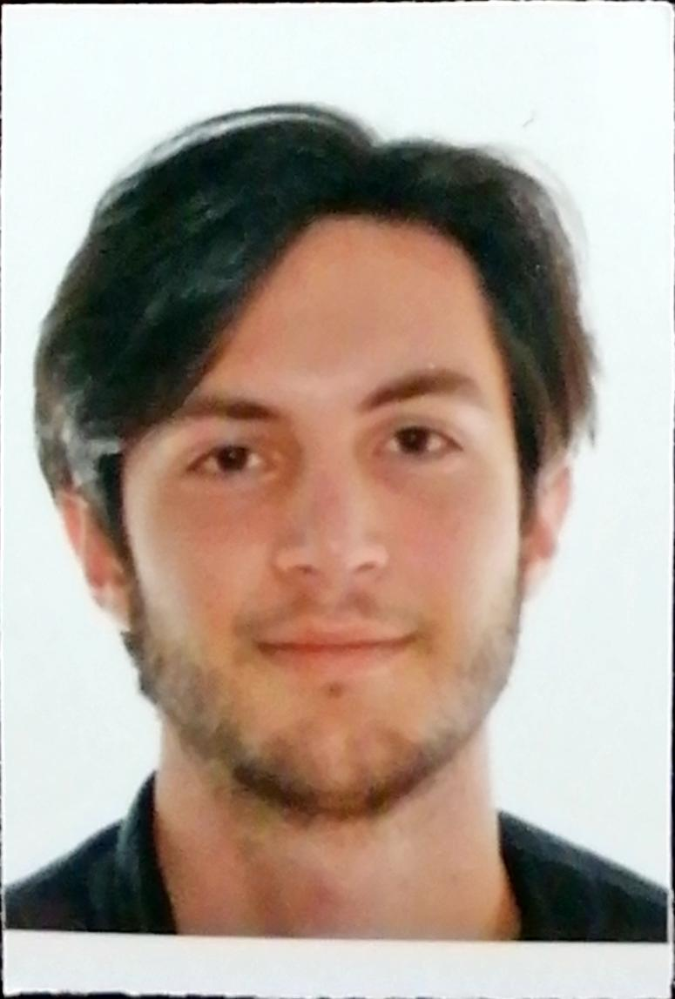
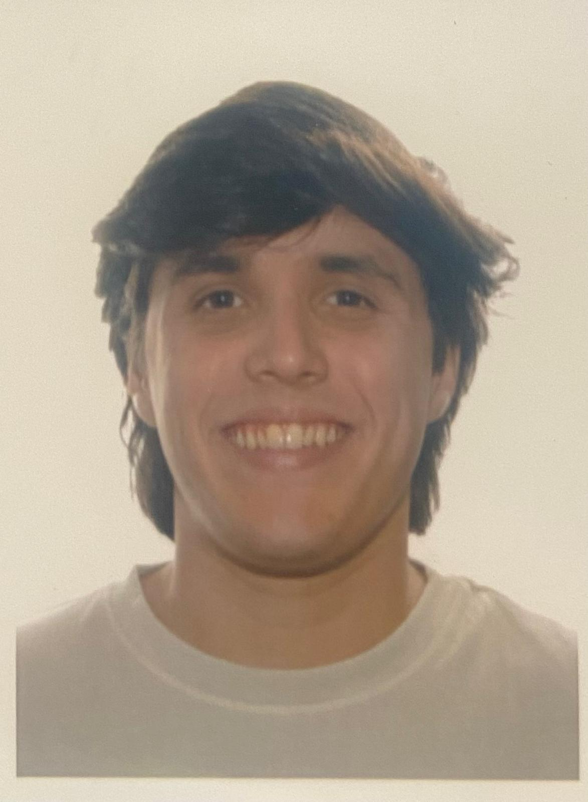
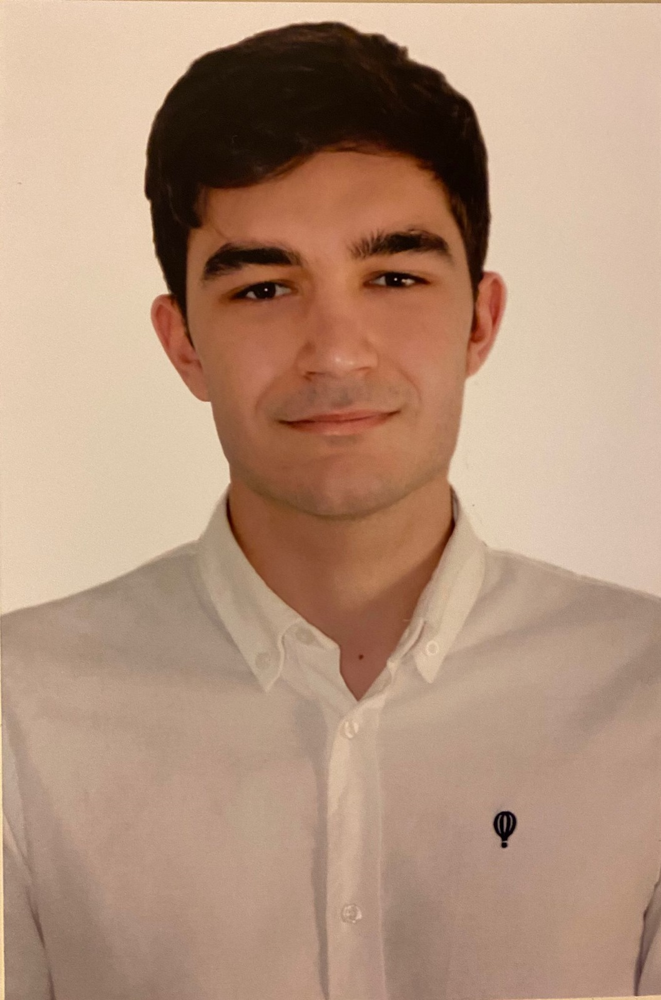

# Chartering Report

## Información general

**Fecha:** 14/02/24

**Grupo:** C1.006

**Repositorio:** https://github.com/Danielruizlopezcc/Acme-SF-D01-24.1.0.git

**Miembros:** 

- Alberto Carmona Sicre (https://github.com/albcarsic)
- Ramón Gavira Sánchez (https://github.com/rgavira123)
- Marco Padilla Gómez (https://github.com/maarcoopg)
- Rafael Pulido Cifuentes (https://github.com/rafpulcif)
- Daniel Ruiz López (https://github.com/Danielruizlopezcc)

## Tabla de contenidos

## Resumen ejecutivo

El proyecto Acme-SF-D01 de la asignatura Diseño y Pruebas II, es un proyecto con fines meramente educativos, con el que se busca mejorar las habilidades y trabajar como desarrolladores web. El objetivo es aprender a producir un sistema de información web típico de tamaño pequeño a mediano basándose en una especificación de requisitos informal y métodos y herramientas de potencia industrial. 

## Tabla de revisión

| Nº de revisión | Fecha | Descripción |
| --- | --- | --- |
| 001 | 12/02/24 | Añadidas las secciones de información general, resumen ejecutivo, introducción y tabla de revisión |
| 002 | 13/02/24 | Añadidas las secciones de reclutamiento de miembros, miembros del equipo y declaración decompromiso |
| 003 | 14/02/24 | Añadidas las secciones de desempeño, conclusión y bibliografía  |
| 004 | 15/02/24 | Modificada la sección de reclutamiento de miembros |

## Introducción

En el contexto académico actual, la realización de proyectos grupales se ha convertido en un componente esencial en la formación de estudiantes universitarios, especialmente en disciplinas técnicas como el desarrollo de software. Este informe detalla el primer entregable del proyecto Acme-SF-D01 correspondiente a la asignatura Diseño y Pruebas II, llevado a cabo por el grupo C1.006. El proyecto tiene como objetivo principal el desarrollo de un sistema de información web de tamaño pequeño a mediano, abordando una especificación de requisitos de manera informal con el uso de herramientas y métodos de desarrollo de software de nivel industrial. Este documento no solo describe la composición y compromisos del equipo sino también establece las expectativas en términos de desempeño, delineando claramente lo que se considera un buen y mal desempeño dentro del marco del proyecto. Al hacerlo, se busca no solo cumplir con los objetivos académicos establecidos sino también fomentar el desarrollo de habilidades relevantes en un entorno colaborativo y profesional.

A continuación se describe brevemente la estructura de este documento. En la **Información general** se ofrece de forma concisa información sobre los miembros del grupo C1.006 y el repositorio donde se llevará a cabo el trabajo. En el **Resumen ejecutivo** encontramos una breve descripción del proyecto y los objetivos del mismo. En la **Tabla de revisiones** se anotan todas las revisiones que han sido realizadas, ordenadas por fecha y con una breve descripción. En los **Contenidos** es donde se recoge toda la información detallada sobre el equipo, esto es, la metodología de reclutamiento y los participantes finales, así como una declaración de compromiso y el análisis que se llevará a cabo para el estudio del desempeño de los integrantes. Finalmente, el documento contiene la **Conclusión** y la **Bibliografía** utilizada.  

## Contenidos

### Reclutamiento de miembros

Para este proyecto, siguiendo con las directrices dadas, se ha decidido reclutar a los miembros en base a los siguientes criterios. 

Los miembros poseen las habilidades necesarias para llevar acabo el proyecto (esto incluye conocimientos sobre bases de datos, frameworks, despliegue de aplicaciones web, herramientas de desarrollo, etc.), la experiencia de haber trabajado en otros proyectos de desarrollo web (tanto en back-end como en front-end) y cumplen con las expectativas del manager, las cuales buscan que con este proyecto, se consiga la mayor calificación posible. 

En base a estos estos criterios, se ha decidido confiar en el equipo de proyectos anteriores. Con este equipo se han obtenido grandes resultados tanto académicamente como a nivel personal en el desarrollo de capacidades. Gracias a la experiencia trabajando juntos se garantiza que todos los miembros del grupo conocen las habilidades del resto, son capaces de asumir responsabilidad en cualquier momento y se facilitan un ambiente de trabajo saludable y en el que todos son capaces de dar y recibir feedback, negociar aspectos del proyectos, solicitar ayuda cuando sea necesario y ser capaces de oponerse si así se considera. 

Como último aspecto, aparte de considerar todos los aspectos de experiencia, habilidad, responsabilidad y compromiso de cada uno de los participantes, para el reclutamiento de los miembros se ha considerado el fuerte lazo de amistad y compañerismo que se ha desarrollado durante estos los últimos años y que tan buen ambiente de trabajo a traido al grupo. 

### Miembros del grupo

**Alberto Carmona Sicre**

- Correo electrónico corporativo: albcarsic@alum.us.es

**Ramón Gavira Sánchez**

- Correo electrónico corporativo: ramgavsan@alum.us.es

**Marco Padilla Gómez**

- Correo electrónico corporativo: marpadgom1@alum.us.es

**Rafael Pulido Cifuentes**

- Correo electrónico corporativo: rafpulcif@alum.us.es

**Daniel Ruiz López**

- Correo electrónico corporativo: danruilop1@alum.us.es

### Declaración de compromiso

Nosotros, Alberto Carmona Sicre, Ramón Gavira Sánchez, Marco Padilla Gómez, Rafael Pulido Cifuentes y Daniel Ruiz López, miembros del grupo C1.006, nos comprometemos a colaborar de manera efectiva y constructiva en el desarrollo de todos los proyectos y actividades asignadas en la asignatura Diseño y Pruebas II. Declaramos haber revisado y comprendido en su totalidad el temario de la asignatura, así como los procedimientos de evaluación y calificación establecidos por el profesorado. Con este conocimiento y entendimiento, nos comprometemos a apoyarnos mutuamente y a trabajar con el objetivo de alcanzar una calificación de notable alto en la evaluación final del curso. Entendemos que este compromiso requiere de una dedicación constante, una comunicación abierta y efectiva entre todos los miembros del grupo, y una actitud proactiva para resolver cualquier desafío que se presente. Asumimos esta responsabilidad con la seriedad que merece, con el fin de lograr no solo el éxito académico, sino también un aprendizaje significativo y aplicable en nuestras futuras carreras profesionales.

### Desempeño

***Buen desempeño:*** 

- **Calidad del trabajo:** Entrega de tareas y proyectos que cumplan con los requisitos establecidos. Esto incluye la aplicación correcta de conocimientos y directrices y unos informes del trabajo realizado completos, concisos y sin faltas de ortografía.
- **Contribución activa:** Participación proactiva en todas las fases del proyecto, siempre respetando los roles asignados, haciendo énfasis en los aportes significativos en reuniones, discusiones y toma de decisiones.
- **Colaboración y trabajo en equipo:** Capacidad para trabajar eficazmente no solo a la hora de desarrollar los objetivos individuales sino también con otros miembros del equipo cuando así se requiera, ofreciendo ayuda y fomentando un ambiente de trabajo positivo y productivo.
- **Cumplimiento de plazos:** Entrega de todas las asignaciones y contribuciones al proyecto en un plazo de al menos 4 horas antes de la entrega oficial, mostrando una buena gestión del tiempo y fiabilidad.

Como recompensa por el buen desempeño, a los participantes del equipo se les ofrecerá la oportunidad de asumir roles de liderazgo en futuras entregas o una mayor consideración en la toma de decisiones críticas del trabajo en curso, permitiéndoles desarrollar y demostrar aún más sus habilidades.

Esta política de recompensas tiene como objetivo no solo reconocer el mérito individual sino también fomentar un espíritu de excelencia y cooperación dentro de nuestro equipo.

***Mal desempeño:***

1. **Calidad del trabajo deficiente:** Entregas que no cumplen con los requisitos básicos, muestran una comprensión inadecuada de los conceptos clave o falta de esfuerzo y atención al detalle.
2. **Falta de contribución:** Participación mínima o nula en las tareas del proyecto, ausencia frecuente en reuniones o discusiones, y falta de iniciativa para participar activamente en el trabajo del equipo.
3. **Dificultades en la colaboración:** Incapacidad para trabajar de manera efectiva con los compañeros de equipo, lo que incluye falta de comunicación, no ofrecer o aceptar ayuda, y contribuir a un ambiente de trabajo negativo.
4. **Incumplimiento de plazos:** Retrasos habituales o demasiado ajustados en la entrega de tareas y contribuciones, afectando el progreso del proyecto y la capacidad del equipo para cumplir con los objetivos establecidos y la capacidad de respuesta ante imprevistos y fallos.
5. **Resistencia a las críticas:** Falta de disposición para aceptar y actuar según las críticas constructivas o la incapacidad para ajustar el comportamiento o el trabajo basándose en el feedback recibido.

Si se denota que algún participante esta llevando acabo un mal desempeño, de acorde con lo descrito anteriormente, habrá un seguimiento continuo de su progreso en entregas posteriores. Si se observa una falta de avance significativo o mejora, se realizarán reuniones adicionales para reevaluar su situación y compromiso con el grupo.

Como medida final, si no se observa una mejora sustancial después de las intervenciones previas, se podrán reasignar tareas dentro del equipo para asegurar que el desempeño deficiente de un miembro no afecte el resultado general del proyecto.

Estas medidas no buscan ser punitivas, sino asegurar que todos los miembros del equipo contribuyan de manera equitativa y que el grupo pueda alcanzar sus objetivos colectivos. Se promoverá siempre un ambiente de apoyo, entendimiento y crecimiento mutuo intentando buscar la participación equitativa de todos los miembros del equipo. 

***Decisión de expulsión:***

Si un participante reitera en el mal desempeño de forma que pone en peligro la integridad del proyecto, bien sea por constantes entregas tardías o por problemas ajenos al proyecto con el resto del equipo, se reserva el derecho, por parte de los demás miembros, si así se decide en una votación previa, a que dicho miembro sea expulsado con efecto inmediato. Dicha decisión será comunicada al profesor correspondiente y la asignación de las tareas del miembro expulsado pasarán a ser responsabilidad del resto del equipo. 

La decisión de expulsión podrá tomarse en cualquier momento si su causa es la incompatibilidad total con el resto del equipo, en cambio si lo que se detecta es un déficit de trabajo, se seguirá lo mencionado en la sección anterior, previo a tomar una decisión final. 

## Conclusión

El proyecto Acme-SF-D01 representa una oportunidad significativa para el grupo C1.006 de aplicar conocimientos teóricos en un escenario práctico, enfrentando desafíos reales que se presentan en el desarrollo de sistemas de información web. A través de la colaboración y el compromiso activo de cada miembro, el equipo se propone alcanzar no solo una calificación notable sino también adquirir una experiencia invaluable que será de gran utilidad en su futura carrera profesional. La definición clara de lo que constituye un buen y mal desempeño, asegura que el equipo mantenga un enfoque disciplinado y orientado a resultados a lo largo del proyecto. Con este enfoque, el grupo está bien posicionado para superar los desafíos que surjan y cumplir con éxito los objetivos del proyecto, demostrando así su capacidad para trabajar eficazmente en equipo y desarrollar soluciones de software de calidad.

## Bibliografía

- [Programa de estudios de la asignatura.](https://ev.us.es/ultra/courses/_85092_1/cl/outline)

